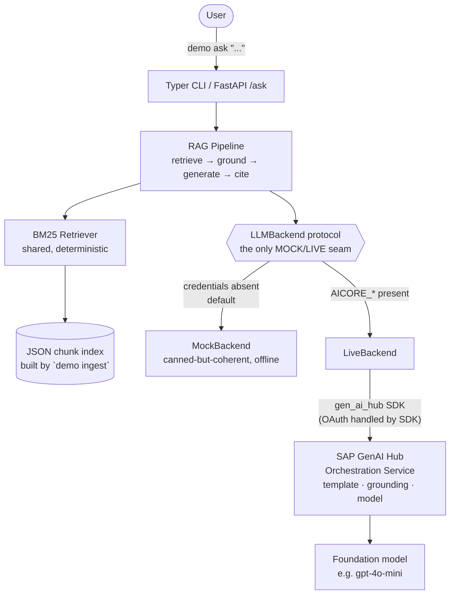

# btp-genai-orchestration-demo

[](https://github.com/haydarkozat/btp-genai-orchestration-demo/actions/workflows/ci.yml)
[](https://www.python.org/)
[](LICENSE)

> I built **[SOUVERÄN-KI](https://github.com/haydarkozat/souveraen-ki)** — a self-hosted,
> open-source enterprise RAG platform (Python, FastAPI, Ollama, Qdrant, LangGraph,
> Keycloak; 43 tests, green CI). This repo demonstrates the **same retrieval-augmented
> generation / grounding pattern re-implemented on SAP BTP**, using the **Generative AI
> Hub orchestration service** instead of a self-hosted stack. It is a focused,
> recruiter-readable proof that the grounding architecture I run on-prem maps cleanly
> onto SAP's managed GenAI offering.

The demo answers IT-operations questions from a set of "runbook" Markdown documents,
grounding each answer in retrieved source sections and **citing exactly which chunks it
used**. It runs in two modes behind a single abstraction — fully offline (**MOCK**, the
default) or against the real SAP orchestration service (**LIVE**).

---

## Architecture

The mode switch turns on **one** clean abstraction — the `LLMBackend` protocol.
Retrieval, grounding, citations and the CLI are identical in both modes; only the
generator changes. There are **no scattered `if mock:` branches** — the factory picks an
implementation and the rest of the program never knows which.



## How SOUVERÄN-KI maps onto SAP BTP / GenAI Hub

A conceptual mapping — the architectural point of this repo. It is **not** a claim that
the two are interchangeable products; it shows that each responsibility in my
open-source stack has a managed equivalent on SAP BTP.

| Responsibility            | SOUVERÄN-KI (self-hosted, OSS)      | SAP BTP / Generative AI Hub equivalent                     |
| ------------------------- | ----------------------------------- | ---------------------------------------------------------- |
| Text generation (LLM)     | Ollama (local models)               | GenAI Hub foundation models via the orchestration service  |
| Vector store / retrieval  | Qdrant                              | SAP HANA Cloud vector engine / orchestration grounding module |
| RAG flow orchestration    | LangGraph pipeline                  | GenAI Hub **orchestration** pipeline (template + grounding + model config) |
| Prompt templating         | App-side prompt templates           | Orchestration **templating** module (`{{?placeholder}}`)   |
| Identity & access         | Keycloak (OIDC)                     | SAP XSUAA / BTP destinations (OAuth)                        |
| Auth token handling       | App-managed OIDC tokens             | Handled by the `gen_ai_hub` SDK from `AICORE_*` env vars   |
| Deployment                | Docker Compose on own hardware      | Cloud Foundry / Kyma on BTP *(out of scope here — see below)* |

> In **this demo**, retrieval is a small, dependency-free local BM25 implementation
> standing in for the vector layer, so the grounding/citation behaviour is identical and
> fully testable in both modes. Only the **generation** step differs between MOCK and
> LIVE.

## Quickstart

### MOCK mode (default — zero credentials, zero network)

```bash
pip install -e .
demo ingest
demo ask "How do I reset a student tablet?"
```

You'll get a grounded answer with a numbered `Sources:` list and a `[backend: mock]`
marker. This is exactly what runs in CI.

### LIVE mode (real SAP GenAI Hub orchestration)

1. Install the optional SAP SDK extra:

   ```bash
   pip install -e ".[live]"
   ```

2. Copy `.env.example` to `.env` and fill in your AI Core **service key** values:

   ```bash
   cp .env.example .env
   # edit .env: AICORE_AUTH_URL, AICORE_CLIENT_ID, AICORE_CLIENT_SECRET,
   #            AICORE_BASE_URL, AICORE_RESOURCE_GROUP, ORCHESTRATION_MODEL
   ```

   When all `AICORE_*` variables are present, the backend auto-switches to LIVE — the
   `gen_ai_hub` SDK performs the OAuth token exchange itself (we never hand-roll it).

3. Run the same commands — they now hit the orchestration service:

   ```bash
   demo ingest
   demo ask "How do I reset a student tablet?"   # -> [backend: live:<model>]
   ```

Check which backend would be used at any time:

```bash
demo info
```

### Optional FastAPI wrapper

```bash
pip install -e ".[api]"
uvicorn btp_genai_orchestration.api:app
# POST /ask {"question": "..."}   ·   GET /health
```

## Honest scope

- **Built and tested against the 30-day SAP Generative AI Hub *Basic Trial*.** The LIVE
  path follows the documented `gen_ai_hub` orchestration API; what you see live depends
  on the models deployed in your trial and resource group (set `ORCHESTRATION_MODEL`
  accordingly — e.g. `gpt-4o-mini`).
- **What runs live vs. mocked:** MOCK mode (the default, and everything in CI) is a
  local BM25 retriever + a deterministic extractive generator — no credentials, no
  network. LIVE mode swaps **only the generation step** for the orchestration service.
- **SDK choice:** the brief named `generative-ai-hub-sdk`, which is now **deprecated** on
  PyPI in favour of its maintained successor **`sap-ai-sdk-gen`** (same `gen_ai_hub`
  import namespace and orchestration API). This repo pins the maintained package.
- **No production-readiness claim.** This is a focused architecture demonstration.

### Out of scope (by design)

- **SAP Build Process Automation** — GUI-driven; handled manually, not in code here.
- **Deploying to Cloud Foundry / Kyma** — the natural next step, mentioned but not done.
- Any claim of production hardening (rate limiting, observability, multi-tenant auth).

## Evidence / screenshots

Real, masked screenshots from a live trial session land in
[`docs/screenshots/`](docs/screenshots/) (see its
[evidence index](docs/screenshots/README.md) for which image proves which exercise:
Launchpad / Orchestration / Grounding).

They are produced with [`tools/capture`](tools/capture/) — a small Playwright tool
that logs in once (manual SAP Universal ID / MFA), then captures each page with PII
masked. The saved login session is never committed. Placeholders until the images
are dropped in.

## Development

```bash
uv pip install -e ".[dev]"
ruff check . && ruff format --check .
mypy
pytest --cov --cov-report=term-missing   # MOCK mode, ≥80% on core logic
pytest -m live                           # LIVE group — skipped without credentials
```

CI (GitHub Actions) runs lint + strict typecheck + tests in MOCK mode on Python 3.11
and 3.12 for every push and PR.

## License

[MIT](LICENSE) © 2026 Haydar Kozat
